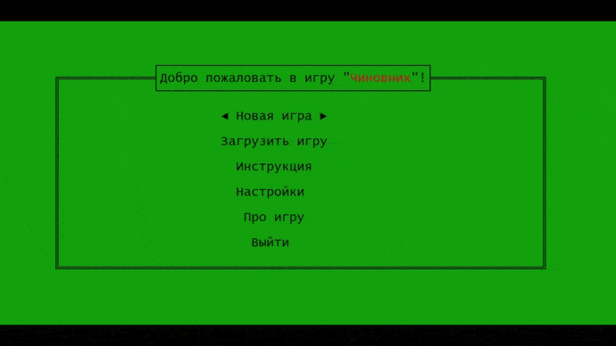

# placeman-game
The CLI game written in Pascal.

## Description

You play the role of a placeman (or official) who steals money from the state. Your task is to collect red dollar signs and thus increase your level. The higher the level, the more obstacles. On the second level, angry villagers appear and prevent you from collecting money. At the tenth level, a percentage sign (taxes) begins to appear around you in a random place. When you accidentally stumble upon it, you will have to pay some amount of money to the state. Throughout the game, you are chased by a police officer. If a police officer arrests you, he will take all your money (i.e. lustrate your property). So be careful and don't get caught by the policeman.

Some actions in the game are performed using commands. You can also turn on the cheat panel and enter cheat commands (or commands for debugging). To do this just type this combination of numbers at any time: `0713091656`.

In addition to collecting money, you can earn money by buying products at the station (in the form of boxes, 1 box contains 10 products) and selling them to stores at a higher price (in the form of the products).

NPC players have different algorithms to catch you, they can go around houses and calculate the shortest routes to you.

Key features:
 - save game state
 - theme change (summer, winter, autumn)
 - enable / disable access to the cheat panel
 - different locations: station, bank, shop, home
 - smart NPC players

## Compatibility
Windows XP, 7.

Windows 10 (there are minor issues with displaying characters).

## Overview
##### Gameplay
